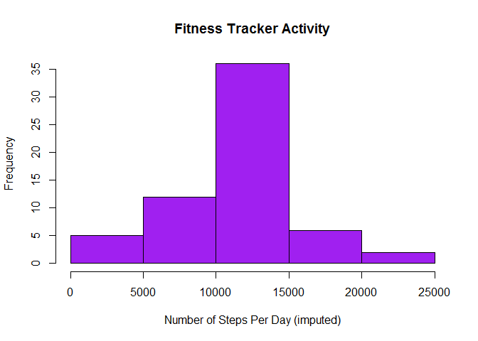

# Reproducible Research: Peer Assessment 1
Chandramouli M  


## Activity Monitor Data Assignment


```r
library(knitr, quiet=T)
library(plyr, quiet=T)  
library(ggplot2, quiet=T) 
opts_chunk$set(dev="png", fig.path="figure/")
```

## Loading and preprocessing the data


## What is mean total number of steps taken per day?


```r
monitor.daily <- ddply(monitor, .(date.factor), summarize,
                        total.steps=sum(steps, na.rm=TRUE))
hist(monitor.daily$total.steps, col="yellow", main=" Activity",
     xlab="no.of Steps Per Day")
```

<!-- -->

```r
pdaymean <- mean(monitor.daily$total.steps, na.rm=TRUE)
pdaymedian <- median(monitor.daily$total.steps, na.rm=TRUE)
cat(paste("The mean number of steps per day is", 
          format(pdaymean, digits=4), "and the median is", 
          format(pdaymedian, digits=2), "(ignoring missing values"))
```

```
## The mean number of steps per day is 9354 and the median is 10395 (ignoring missing values
```


## What is the average daily activity pattern?

<!-- -->


## Imputing missing values


```r
nmissing <- sum(!complete.cases(monitor))

cat(paste("Number of rows with missing data:", nmissing))
```

```
## Number of rows with missing data: 2304
```

```r
impute.value <- function(steps, interval) {
    if (is.na(steps)) {
        monitor.pattern[monitor.pattern$interval==interval,]$mean
    } else {
        steps
    }
}
imputed.monitor <- monitor

imputed.monitor$steps <- mapply(impute.value, monitor$steps, 
                                monitor$interval)

total.steps <- tapply(monitor$steps, monitor$date.factor,
                      sum, na.rm=TRUE)
total.steps.imputed <- tapply(imputed.monitor$steps,
                              imputed.monitor$date.factor, sum)
cat(paste("For the raw data the mean and median per day are:",
          format(mean(total.steps)), "and", median(total.steps)))
```

```
## For the raw data the mean and median per day are: 9354.23 and 10395
```

```r
cat(paste("For the imputed the mean and median per day are:",
          format(mean(total.steps.imputed)), "and",
          format(median(total.steps.imputed))))
```

```
## For the imputed the mean and median per day are: 10766.19 and 10766.19
```

```r
hist(total.steps.imputed, col="purple", main="Fitness Tracker Activity",
     xlab="Number of Steps Per Day (imputed)")
```

<!-- -->


## Are there differences in activity patterns between weekdays and weekends?

<!-- -->


